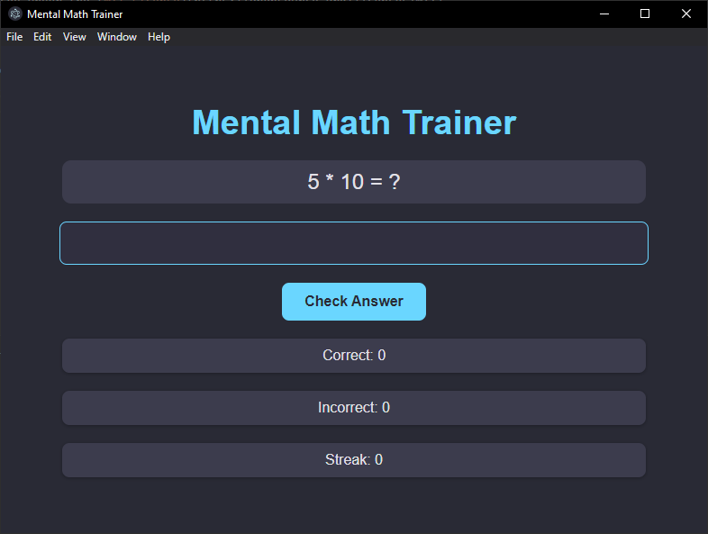

# **Math Trainer**

A simple mental math trainer application built with [Electron](https://www.electronjs.org/). The app helps users improve their math skills by generating random multiplication problems and tracking their progress.

**Note:** This project is primarily designed for **educational purposes**, especially for use in computer science classes to introduce the basics of Electron and cross-platform application development.

---

## **Features**
- Randomized multiplication problems.
- Tracks the number of correct and incorrect answers.
- Keeps a streak count of consecutive correct answers.
- Clean and modern dark theme inspired by productivity tools like Obsidian and Todoist.
- Built-in packaging support for Windows (using Electron Forge).

---

## **Getting Started**

### **Prerequisites**
Before running the application, ensure you have the following installed:
- **Node.js** (v16.x or v18.x recommended)
- **npm** (comes with Node.js)

### **Installation**
1. Clone the repository:
   ```bash
   git clone https://github.com/yourusername/math-trainer.git
   ```
2. Navigate to the project directory:
   ```bash
   cd math-trainer
   ```
3. Install dependencies:
   ```bash
   npm install
   ```

---

## **Usage**

### **Development Mode**
To run the application in development mode:
```bash
npm start
```

### **Building the Application**
To package the application for Windows:
```bash
npm run make
```

The distributable files will be located in the `out` directory.

---

## **Technologies Used**
- [Electron](https://www.electronjs.org/): Framework for building cross-platform desktop apps with JavaScript, HTML, and CSS.
- [Electron Forge](https://www.electronforge.io/): Tooling for packaging and distributing Electron apps.

---

## **Educational Purpose**
This project is designed for educational purposes to demonstrate:
- How to build cross-platform desktop applications using Electron.
- Setting up Electron Forge for packaging and distributing applications.
- Basic JavaScript and web development concepts in the context of desktop app development.

---

## **Contributing**
Contributions are welcome! If you have ideas for new features or improvements, feel free to open an issue or create a pull request.

---

## **License**
This project is licensed under the [MIT License](https://opensource.org/licenses/MIT).

---

## **Screenshots**

